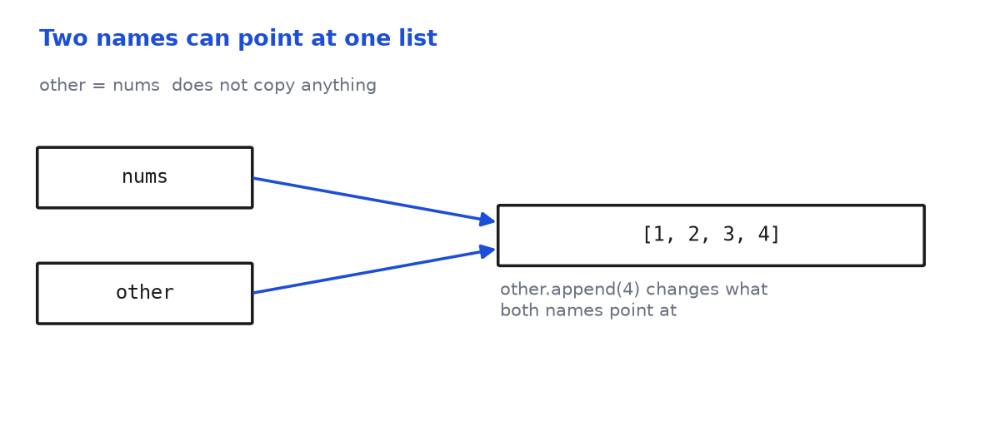

# Lists

Practice Python lists, and learn when a function changes a list instead of
returning a new one.

**Practicing:** lists, mutation, pure functions

- [AI Use on This Assignment](#ai-use-on-this-assignment)
- [Setup](#setup)
- [Before You Start](#before-you-start)
- [From Scratch](#from-scratch)
  - [Question 1: `add_to_front_or_back`](#question-1-add_to_front_or_back--mutates)
  - [Question 2: `reverse_string`](#question-2-reverse_string--pure)
  - [Question 3: `new_list_full_of`](#question-3-new_list_full_of--pure)
  - [Question 4: `insert_into_middle`](#question-4-insert_into_middle--mutates)
  - [Question 5: `delete_from_middle`](#question-5-delete_from_middle--mutates)
  - [Question 6: `is_right_index`](#question-6-is_right_index--pure)
  - [Question 7: `round_all_nums_down`](#question-7-round_all_nums_down--pure)
  - [Question 8: `get_all_y_coordinates`](#question-8-get_all_y_coordinates--pure)
- [Modify](#modify)
  - [Question 9: `uppercase_all`](#question-9-uppercase_all)
  - [Question 10: `unpack_coordinates`](#question-10-unpack_coordinates)
- [Debug](#debug)
  - [Question 11: `clear_list`](#question-11-clear_list)
  - [Question 12: `get_first_item`](#question-12-get_first_item)
- [Bonus](#bonus-names-objects-and-copies)
- [Submitting](#submitting)
- [Good luck!](#good-luck)

## AI Use on This Assignment

Use whichever mode matches where you are with this material. Both are fine,
and most people move between them as a concept clicks.

**Tutor mode.** The AI explains, questions, quizzes, and critiques, and you
write every line you submit. For this assignment that means asking it why
changing a list inside a function can affect the caller, or having it quiz you
until you can predict what your own code will do. Ask it a hundred questions —
that is the whole point. What you do not do is ask it for the function. Paste
this at the start of a chat and it will hold for the rest of the conversation:

> You are acting as a tutor. Your job is to explain what this coding question
> is asking, clarify confusing wording, and highlight the relevant concepts I
> need to know — but do not provide the full solution or code that directly
> answers the question. Instead, rephrase the problem in simpler terms,
> identify what is being tested, and suggest what steps or thought processes
> might help. Ask me guiding questions to make sure I am thinking critically.
> Do not write the final function, algorithm, or code implementation.

**Implementer mode.** You write a specification first, the AI writes code from
it, and then you verify that code line by line. For this assignment your spec
has to say, for every function, whether it changes the list in place or
returns a new one. If what comes back does more than you asked for, reject it
— over-delivery is a defect, and catching it is part of the job.

You own every line either way, and you will be asked to explain it.

## Setup

Work in `development/mod-1`. Make a draft branch before you start.

```sh
python3 -m venv .venv
source .venv/bin/activate
pip install -r requirements.txt
git checkout -b draft
```

Run `pytest` for everything, or `pytest -k reverse_string` for one question.
Scores land in `scores/scores.json`.

75% of tests passing counts as complete. Submit at that point even if it is
not perfect. Treat submitting as a checkpoint rather than a finish line, and
come back to improve it.

## Before You Start

Tonight is all about lists. We covered a lot in class, but you will still
need the docs for a few list methods.

In functional programming, a **pure** function always gives the same output
for the same input and has no side effects. A **side effect** is something
like changing a global variable or mutating an argument. Lists are the first
type you have met that can be mutated. Only mutate when you mean to, and make
a copy for everything else.

One more idea worth having straight. A variable is a **name pointing at an
object**, and assigning one name to another copies nothing:



Both names point at one list, so `other.append(4)` changes what `nums` sees
too. That idea is behind questions 11 and 12:

![Two panels. On the left, lst = [] points the local name at a new empty list while nums still points at the original. On the right, lst.clear() empties the one list both names share](./ref_examples/rebinding-vs-mutating.png)

Run `python3 ref_examples/reference_example.py` to poke at both yourself.

## From Scratch

Write your solutions in `src/from_scratch.py`.

### Question 1: `add_to_front_or_back` — MUTATES

Write a function `add_to_front_or_back` that takes three arguments: a list
`lst`, a `value` of any type, and a boolean `is_front`. It inserts the value
at the front or the back depending on the boolean. It should change the list
in place and return nothing.

```python
nums = [1, 2, 3]
add_to_front_or_back(nums, 0, True)
print(nums)   # [0, 1, 2, 3]
```

### Question 2: `reverse_string` — PURE

Write a function `reverse_string` that takes a `text` argument and returns a
reversed version of it. Will this change the original string in any way? Food
for thought.

```python
reverse_string("hello")   # "olleh"
```

Before you go crazy with loops, check out
[slicing](https://www.w3schools.com/python/python_strings_slicing.asp) — its
third number can do this in one step. Now, if you want to do it *manually*
with a loop, go crazy! It's fun, but know there's a common way to do this.

### Question 3: `new_list_full_of` — PURE

Write a function `new_list_full_of` that takes a `value` of any type and a
number `count`, and returns a new list full of that value.

```python
new_list_full_of(5, 3)     # [5, 5, 5]
new_list_full_of(0, 0)     # []
```

This might be a stumper, but try experimenting with an
[operator](https://www.w3schools.com/python/python_operators.asp) you already
use for math — it does something surprising to a list. HmmmmMMMMmmm?

This is a cool trick to know, I can't wait till you learn it too!

### Question 4: `insert_into_middle` — MUTATES

Write a function `insert_into_middle` that takes a list `lst` and a `value`.
It finds the middle index and inserts the value there, changing the list in
place and returning nothing. An empty list is still valid input.

```python
nums = [1, 2, 3, 4, 5]
insert_into_middle(nums, 6)
print(nums)   # [1, 2, 6, 3, 4, 5]
```

Check the tests for which index counts as the middle.

### Question 5: `delete_from_middle` — MUTATES

Write a function `delete_from_middle` that takes a list `lst` and removes
whatever sits at its middle index. It changes the list in place and returns
nothing. An empty list must not raise an error.

```python
nums = [1, 2, 3, 4, 5]
delete_from_middle(nums)
print(nums)   # [1, 2, 4, 5]
```

### Question 6: `is_right_index` — PURE

Write a function `is_right_index` that takes a list `lst`, a `value`, and a
number `index`. It returns `True` if the value sits at that index, `False`
otherwise. That includes `False` for values not in the list at all.

```python
letters = ["a", "b", "c"]
is_right_index(letters, "a", 0)     # True
is_right_index(letters, "WOW", 1)   # False
```

### Question 7: `round_all_nums_down` — PURE

Write a function `round_all_nums_down` that takes a list of numbers and
returns a *new* list with each one rounded down. The original list should not
be modified in any way.

```python
round_all_nums_down([5.9, -7.9, 12.9])   # [5, -8, 12]
```

Careful with that `-7.9`. Rounding down means going *down*, to `-8`. Try
`int(-7.9)` and see if it agrees.

### Question 8: `get_all_y_coordinates` — PURE

Write a function `get_all_y_coordinates` that takes a list of coordinate
lists such as `[x, y]`. It should return a *new* list of only the `y` values,
which are the second item in each one.

```python
get_all_y_coordinates([[1, 2], [3, 4], [5, 6]])      # [2, 4, 6]
get_all_y_coordinates([[1, 2, 3], [4, 5, 6]])        # [2, 5]
```

A [list comprehension](https://www.w3schools.com/python/python_lists_comprehension.asp)
makes this a one-liner once you see it.

This is *technically* a matrix function. How about that? You've barely started
Marcy and you're already parsing matrices.

## Modify

Change the two functions already in `src/modify.py`.

### Question 9: `uppercase_all`

Modify `uppercase_all` so it takes any number of word arguments, including
none, and returns a list of them uppercased. It currently insists on exactly
three.

We will never pass in a list as an argument, only individual word arguments.

Read up on [`*args`](https://www.w3schools.com/python/gloss_python_function_arbitrary_arguments.asp),
which lets a function accept as many arguments as it is given.

```python
uppercase_all("hello", "world")   # ["HELLO", "WORLD"]
uppercase_all()                   # []
```

We never pass a list, only separate word arguments.

### Question 10: `unpack_coordinates`

Rewrite `unpack_coordinates` to use **tuple unpacking** instead of pulling
values out by index.

**Unpacking** assigns several names at once from one sequence, so
`x, y = [1, 2]` gives you both in a single line. Keep the names `x` and `y` —
the tests are explicitly looking for those, and I want you to get the points.
They also check the f-string is untouched.

```python
unpack_coordinates([1, 2])   # "X is: 1, Y is: 2"
```

## Debug

Both functions in `src/debug.py` are broken.

### Question 11: `clear_list`

`clear_list` is supposed to empty the list it is given, but the list comes
back with everything still in it. What does `lst = []` actually do to the name
`lst` inside the function, and does the caller ever see it? Fix it so the
caller's list really is emptied.

```python
nums = [1, 2, 3]
clear_list(nums)
print(nums)   # want [] but get [1, 2, 3]
```

### Question 12: `get_first_item`

`get_first_item` in `src/debug.py` is *not* supposed to change the list it is
given. We just want the first item. But right now the caller's list comes back
one item shorter every single time.

Which method is doing the damage, and what could read the first item without
removing it? Fix it so that:

- the first item is returned
- the caller's list is left exactly as it was
- an empty list returns `None` rather than raising an error

```python
nums = [1, 2, 3]
get_first_item(nums)   # 1, correct
print(nums)            # want [1, 2, 3] but get [2, 3]
```

## Bonus: names, objects, and copies

### Question 13 (Optional): why does the copy change?

Run `python3 ref_examples/reference_example.py` and read it beside the two
diagrams there. Its last example copies a list, changes the original, and the
copy changes too.

Write your answer as a comment at the bottom of `ref_examples/reference_example.py`.
Two or three sentences is plenty.

This one is worth sitting with. Once it clicks, a lot of confusing bugs stop
being confusing.

## Submitting

```sh
git add -A
git commit -m "your message"
git push
```

Open a pull request to your instructor for feedback.

## Good luck!

Mutation trips up almost everyone the first time. Once it clicks, a whole
category of confusing bugs stops being confusing. You got this!
